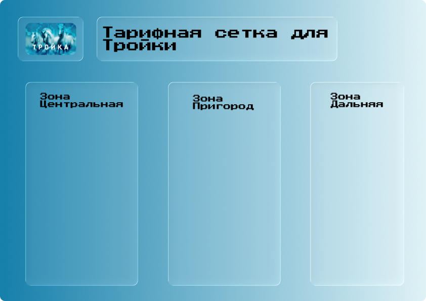



Пока что не готово - Фея Крестная скоро все сделает



# Тройка

Тройка - транспортная карта Москвы и области, а также других городов которые подключили их.

Особенность Тройки в том, что он позволяет экономить стоимость проезда как разово, так и при покупке абонементов.

При привязке Тройки в приложении "Метро Москвы" - появляется возможность переносить, замораживать баланс карты, а также появляется бесплатная пересадка между транспортом в течение 90 минут (на наземном транспорте пересадка с доплатой, между наземным транспортом - бесплатно)

## Тарифы для Тройки

{width=596 height=846}

## Где работает?

Везде на МЦД прямо на турникете или валидаторе с бесплатной пересадкой на метро и МЦК в течение 90 минут.



Прикладывайте карту к турникету или валидатору при входе и выходе, иначе она заблокируется. Разблокировка карт - с доплатой к кассе или билетном автомате.



На некоторых станциях Павелецкого и Ярославского направлений можно оплатить проезд по кошельку Тройки прямо на турникете или валидаторе (без бесплатной пересадки на метро и МЦК)

[//]: # (Здесь картинка)

## F.A.Q по Тройке:





Тройка заблокируется и придется его разблокировать в кассах с доплатой в 232 рубля.









Тройка заблокируется, при выходе придется покупать билет со сбором в 300 рублей, а также оплачивать сбор за разблокировку карты.
(Лайфхак: просто пополните Тройку и не надо будет оплачивать сбор)









Тройка заблокируется (если вы не выйдете по нему в течении 4-х часов), в случае контроля в поезде - кассир-контролер потребует оплатить проезд и оформить новый билет со сбором в 200 рублей.









Нет, приоретет срабатывание Тройки будет такой: разовый билет и потом Кошелек.









Да, можно спокойно записать билет на экспресс без указание мест.

Но! На Тройку нельзя записать билет на экспресс С УКАЗАНИЕМ МЕСТ!!!




